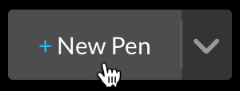
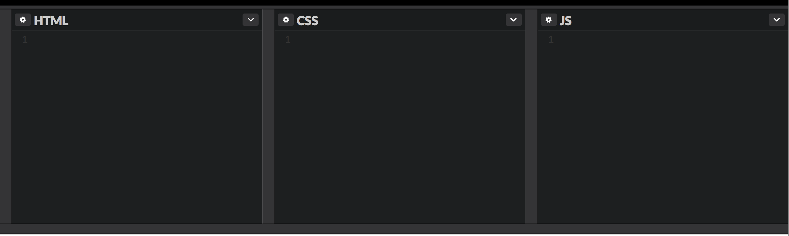
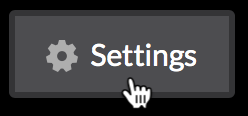
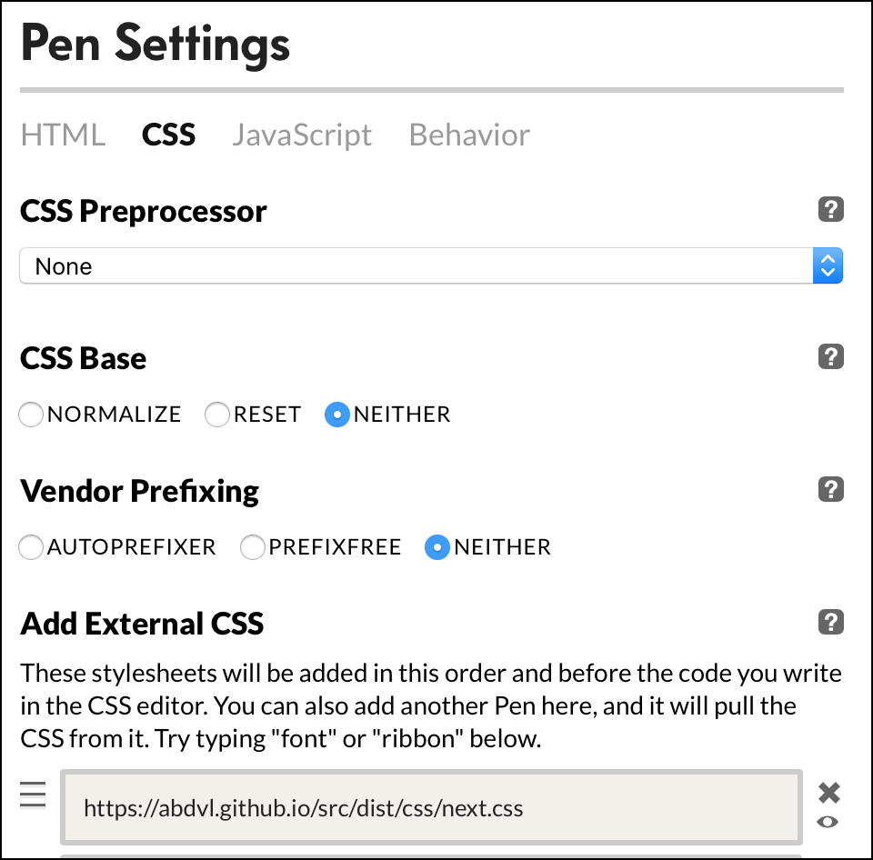
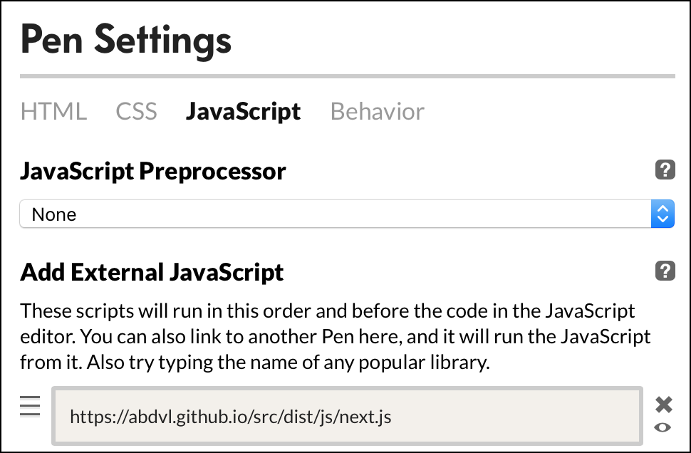
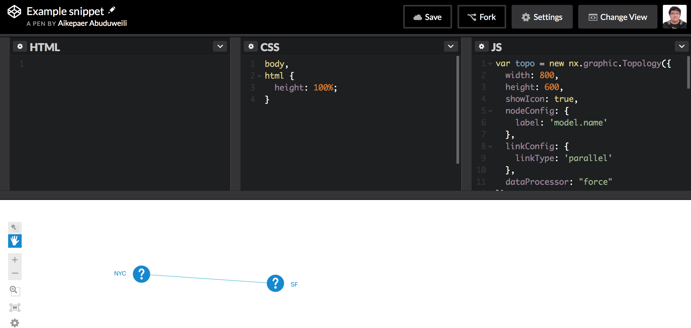
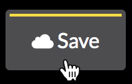

# Guide to Publishing Code Snippets

When it comes to reaching out to technical support, you may need to share code snippets that illustrate the matter. The snippet is a small block of code that works on its own without necessity for the other party to install the entire environment.

Thus, the purpose of the code snippet is to localize an issue, or a bug, and to share the details with the NEXT team.

## JS Sandboxes
A lot of companies and Internet services provide web-based JavaScript sandboxes for free. Here's a short list of most known ones:

* [Codepen](http://codepen.io)
* [JSfiddle](https://jsfiddle.net)
* [Plunker](http://plnkr.co)

There are many more others, so choose one you prefer. 

## Create New Snippet
We normally use Codepen for the examples we share in our support group and mailer, and for the published tutorials.

### Initialize a pen
First, hit "New Pen":



Three panels (HTML, CSS, JS) will show up:



### Include library files
Press "Settings" button to reveal the window.



Tap the CSS tab and add ```https://abdvl.github.io/src/dist/css/next.css``` as an external CSS.



Then tap the JavaScript tab and add ```https://abdvl.github.io/src/dist/js/next.js``` as an external JavaScript.



### Start coding
Now you can start writing code of your snippet.



### Save content
Don't forget to save your code before you copy the link and close the tab.



