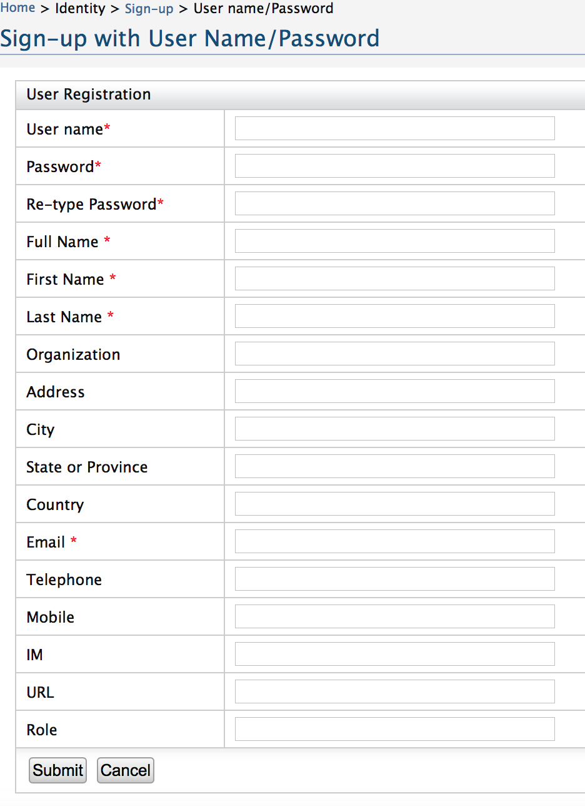
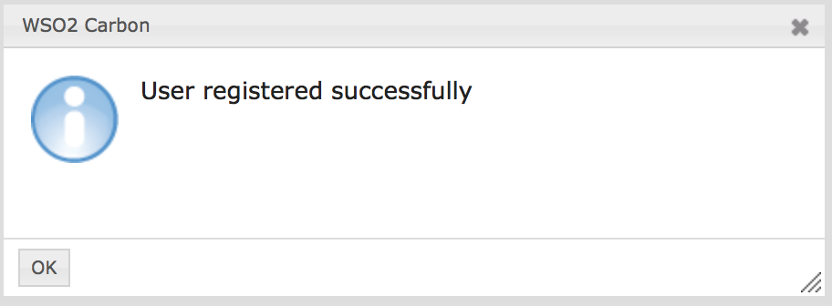

# Contributor's Guide
There are who develop NeXt and who use it. The both categories are very welcome. Since most articles are tutorials for NeXt's users, we decided to dedicate one to those who wish to take part in creating NeXt.

Please read this article to get to know how you can help the open-source community benefit from our mutual effort.

## OpenDaylight Aside
If you have read the [FAQ](faq.md), you should know that NeXt is a part of [OpenDaylight (ODL)](https://opendaylight.org). OpenDaylight is a big open-source project, supported by multiple leading telecom vendors, and is aimed to create a comprehensive SDN platform. 

This is why we use OpenDaylight's ecosystem to contribute into it.

## Get Started
First of all, you must [register](https://identity.opendaylight.org/carbon/user-registration/user-registration.jsp) to make changes.

Below is the screenshot of ODL's registration form.


*Figure 1. Registration form on OpenDaylight website*

When you've filled it out and hit "Submit", you will see the message about successful registration.



That's it about registration. Your username and password will work in all OpenDaylight's apps, such as Gerrit code review, Bugzilla, Jenkins etc.

## Read OpenDaylight's Materials
OpenDaylight project has its own [Contributor's Guide](https://wiki.opendaylight.org/view/GettingStarted:Pulling,_Hacking,_and_Pushing_All_the_Code_from_the_CLI). We hightly recommend you read it and make sure you follow most installation steps from it.

Important: you actually do not need to install OpenDaylight, karaf and special software to write Java code. Like we said, NeXt is the part of ODL, but it could work separately anf does not depend on it. 

The vital part from that article for you is **Gerrit workflow**. It has detailed info on configuration, setup and practical usage. 

## Pull It
You could clone the repository before, but now you will be able to push in it.

Let's clone it (you must have [git](https://git-scm.com) installed on your computer):

```Shell
git clone https://git.opendaylight.org/gerrit/next
```

Now you have a copy of code in your system.

### Gitweb
To review commits and history you can access the repo on [Gerrit Gitweb](https://git.opendaylight.org/gerrit/gitweb?p=next.git;a=summary).

## Discuss It
We do welcome new people, but let's reach a consensus. When you decide to add new functionality, it might go against the idea of the framework, or could duplicate existing functionality.

**Discuss before you do.** Send your message to the maillist and listen to what people think. That's essential. The project lead is Aikepaer Abuduweili, and he is responsible for the architecture. 

## Test It
It may sound obvious, but **test before you push**. Seriously. After you're done with coding, please make a build and make sure nothing broke and works the way it should. Ideally, you should make a test script for changes.

In 

## ~~Push~~ review it
Let's imagine you've made some changes: added a new feature or fixed a bug. You have already tested it out and revealed no errors. Time to push?

In fact, if you read the OpenDaylight materials from the beginning of the article you should have seen the mechanism described there. Instead of standart git mechanism of "pushing" you'll use a tool called "git-review", which will actually push to a special branch. Make sure to have configured it properly. The article from OpenDaylight has enough information to do so.

What happens next? The commit gets verified: during automatic tests and manual moderation.

## Get Pushed
If moderation and tests revealed no problems, the commit gets merged into the master branch.

Congratulations! You made the framework better and people happier!