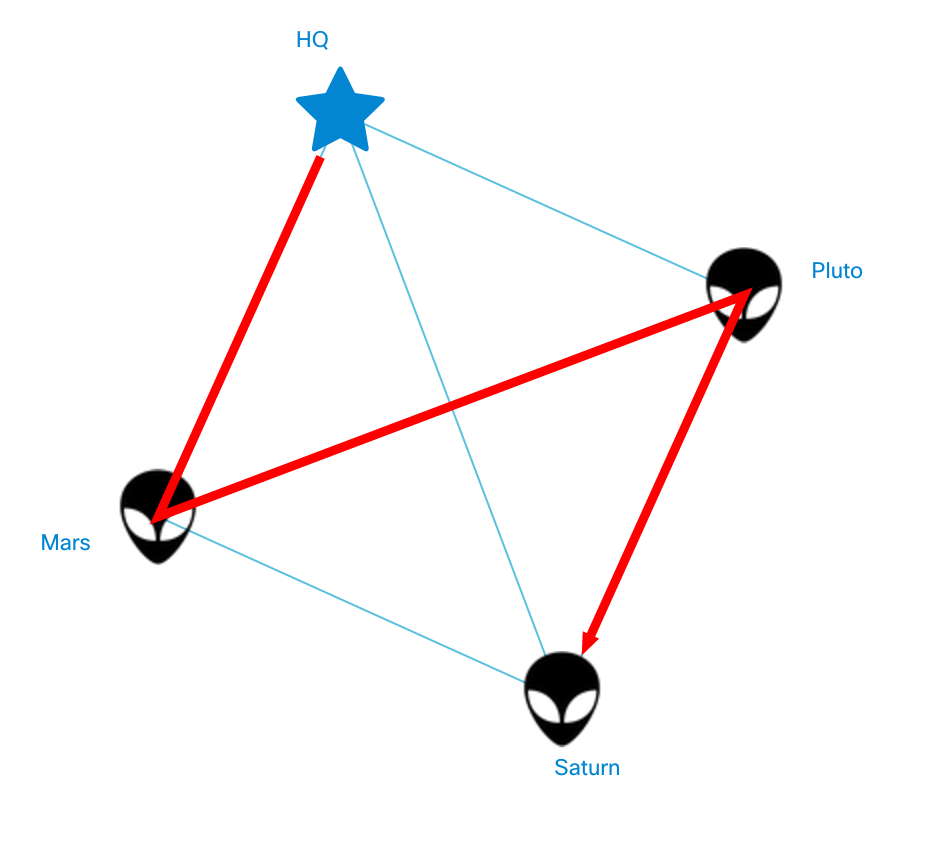

# Path Drawing
In networking you always have to think about the optimal route of traffic in the network. To visualize that, NeXt has a built-in mechanism called "Paths". Paths are implemented by class ```nx.graphic.Topology.Path ``` that provides convenient interfaces for the developer.

## Assign Reference to Topology Object
The first thing you need to do is to pass the reference to topology's instance inside the action panel's instance. You may be wondering, why. The reason being is simple: the action panel does refer to the app, but not to the topology. Essentially, you may have as many topologies or other components in the same NeXt application (```nx.ui.Application```) as you want. However, if you want them to know about each other, just pass the instances to the other instances.

### Code
In the class ```ActionPanel```, please make sure to have the ```properties``` section, and then add empty property named ```topology```:

#### /app/action-panel.js (excerpt)
```JavaScript
// ...

properties: {
	topology: {}
}

// ...
```

You will need to pass the reference to topology instance, once both topology and action panel are initialized: 

#### /app/main.js (excerpt)
```JavaScript
// ...

// instantiate Topology class
var topology = new MyTopology();
// instantiate ActionPanel class
var actionPanel = new ActionPanel();
actionPanel.topology(topology);

// ...
```

This will make NeXt store the reference in ```ActionPanel```'s property ```topology```.

## Add Basic Path
We'll start with a simple path over topology. Open up ```action-panel.js``` and keep it open.

### /app/action-panel.js (excerpt)
```JavaScript
// ...

// add random path
"onDrawPath": function(sender, events){
	var topo = this.topology();
	var pathLayer = topo.getLayer("paths");
	var pathLinks = [
		// HQ -> Mars
		topo.getLink(0),
		// Mars -> Pluto
		topo.getLink(5),
		// Pluto -> Saturn
		topo.getLink(4)

	];

	// create Path object
	var path = new nx.graphic.Topology.Path({
		"pathWidth": 3,
		"links": pathLinks,
		"arrow": "cap",
		"pathStyle": {
			// path's color
			"fill": "#ff0000"
		}
	});

	pathLayer.addPath(path);
}

// ...
```

## Clear Path Layer
We are going to modify the same file.

### /app/action-panel.js (excerpt)
```JavaScript
// ...

// wipe off the 
"onClearPaths": function(sender, events){
	var pathLayer = this.topology().getLayer("path");
	pathLayer.clearPathLayer();
}

// ...
```

## Result
Once a user clicks "Draw Path", they will see the following picture:



You can find a code example in **/demos/tutorial-007-04/**

## What's next?
The next tutorial covers class extension.

[Read NEXT](./letsplay-05.md)