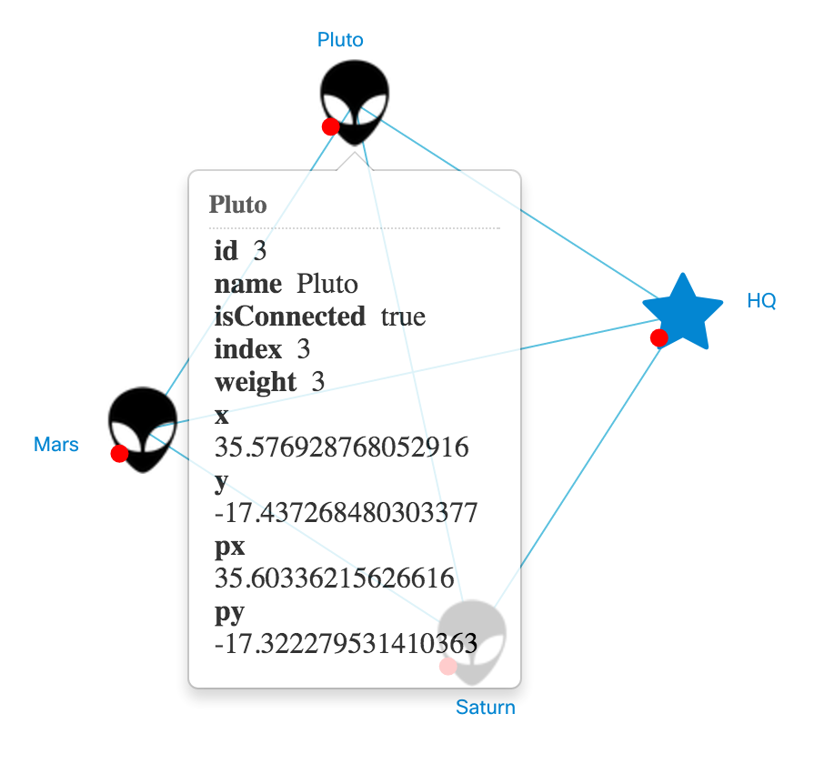

# Scene Manipulation
[Scene](../tutorial-003-07.md) is the object that controls the behavior of stopology's area.

## Task
The goal is to make the tooltips show up when a user hovers over nodes (by default, they appear by click). Instead, by click the user will toggle the nodes' "connection" to the network. Initially, each node is connected.

Note: of course, that's just an example and we are not managing any network (yet). However, the knowledge you obtain in these lessons will let you create apps that are connected to real networks. Moreover, actions you take to create the "offline" app, will be similar for an "online" app, too. For us, this just simplifies the educational process: no network/backend troubleshooting, no overwhelming number of lines and difficult-to-understand code.

## Implementation
### Little Update
First of all, move out the condition code block out of ```setModel``` like that:

#### /app/extended-node.js (excerpt)
```JavaScript
// ...

// called when the model is about to initialize
'setModel': function (model) {
	this.inherited(model);
	this.updateBadge();
},

"updateBadge": function(){
	// draw/not draw the badge based on status
	if (this.model().get("isConnected"))
		this._hideDownBadge();
	else
		this._showDownBadge();
},

// ...
```

### New Scene
To create a scene, you need to inherit a scene. That's how it works! And we are serious about it.

Create a new file with name ```extended-scene.js``` in the ```app``` directory.

#### /app/extended-scene.js
```JavaScript
nx.define('ExtendedScene', nx.graphic.Topology.DefaultScene, {
	methods: {
		clickNode: function(sender, node){
			node.model().set("isConnected", !node.model().get("isConnected"));
			node.updateBadge();
		}
	}
});
```

Also, you will need to link the JavaScript file to the HTML page. Insert the tag below, followed by linking of "main.js"

#### index.html (excerpt)
```HTML
<!-- ... -->
<script type="text/javascript" src="app/extended-scene.js"></script>
<!-- ... -->
```

### Activate Scene
You must register the scene to make NeXt associate it with the current topology. The scene will not affect the experience until activated. The both operation may run together (see below) right after instanciation of ```nx.graphic.Topology```.

#### /app/main.js
```JavaScript
// ...
topology.on("topologyGenerated", function(topo, event){
	topo.registerScene('extended-scene', 'ExtendedScene');
	topo.activateScene('extended-scene');
});
// ...
```

## Result
Now when you hit a node it toggles the status. Wait... Why is that tooltip popping up after the click?



That's Tooltip Policy in action! To prevent that from happenning you will need to extend it, too.

## What's next?
Right, we're going to hack tooltip policy to make tooltips show up by entering the node's area and without a click.

[Read NEXT](./letsplay-07.md)