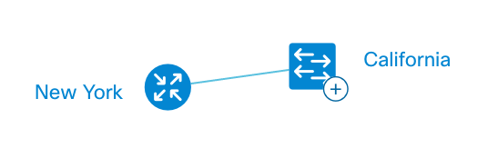
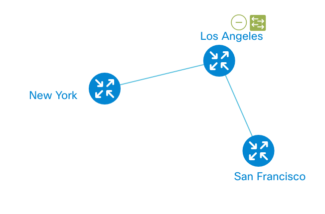

# Node Sets
Node set (usually spelled *nodeset*) is a special topology object that is not an end-point device (node), but rather a virtual container for a group of nodes. It is known for ability to collapse (hide the group of nodes) and expand (reveal them). 

That is a very necessary tool when you need to group the nodes and wish to lack excessive physical representation of devices: when you expand the nodeset, it simply goes away.

## Example
```JavaScript
var topologyData = {
	// define 3 nodess
	"nodes": [
		{
			"id": 0,
			"name": "San Francisco"
		},
		{
			"id": 1,
			"name": "Los Angeles"
		},
		{
			"id": 2,
			"name": "New York"
		}
	],
	// and links
	"links": [
		{
			"source": 0,
			"target": 1
		},
		{
			"source": 1,
			"target": 2
		}
	],
	// unite nodes with IDs 0 & 1 into a nodeset
	"nodeSet": [
		{
			"id": 3,
			"nodes": [0, 1]
		}
	]
};
```

## Demo
See the full example on [Codepen]().

### Collapsed


### Expanded


In the detailed example, take a look at "nodeSetConfig" please. That's how we set the label for the nodeset. By default the label is empty.

## Expanded by Default
TBD: found a bug

## Important to Know
That's important to know that:

* IDs namespace of nodes and nodesets overlay each other. That means you cannot have node with ```id=123``` and a nodeset with the same ID.
* *[Autolayout](tutorial-003-03.md)* does not work for nodesets. There's a [hack on JSfiddle](https://jsfiddle.net/nextsupport/4Lr3kuos/). 


## What's next?
TBD