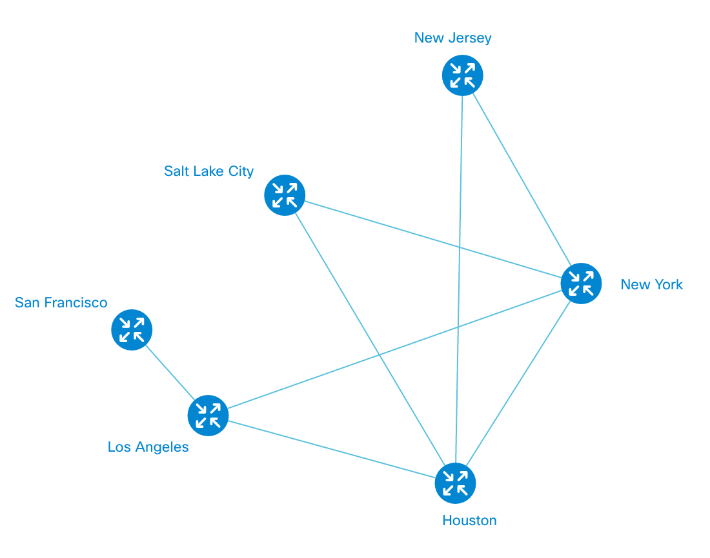
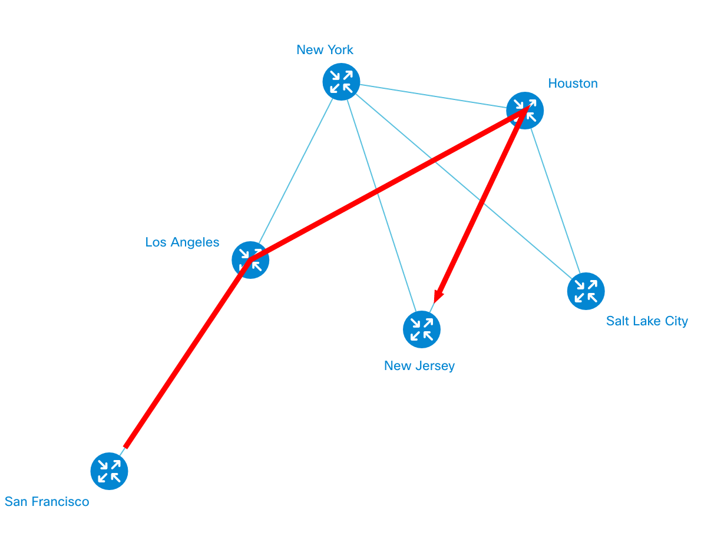

# Path Drawing
Paths are as important to NeXt as they are to networking. 

## Layers Aside
You'll learn more about the layers and how we use them in NeXt. What you need to know now is that NeXt automatically sorts instances of the standard classes (such as nodes, links, node set etc.) into special collections, called layers. You can get the list of nodes from the *node layer*, list of links from the *link layer* and so on. You're following the idea, don't you?

## Example
Let's imagine we've got such a crazy topology:



The code will be available below.

### Hop list

What path are we going to take? Let it be San Francisco for New Jersey through Los Angeles and Houston (SF -> LA -> Houston -> NJ). The array that represents the path would look like that:

```JavaScript
var pathHops = [
	"San Francisco",
	"Los Angeles",
	"Houston",
	"New Jersey"
]
```

It is just the hop list in a correct order.

### Get link list
Let's write a function that pulls up the list of link instances. Link instance is the object instanciated from ```nx.graphic.Topology.Link``` that represents a specific link. Why do we need the link list? We use the list to hightlight the path on the topology, simply connecting the link by link to find out the pattern of the path.

```JavaScript
function getLinkList(topology, nodesDict, pathHops){

	var linkList = [];

	for(var i = 0; i < pathHops.length - 1; i++){

		var srcNode = nodesDict.getItem(pathHops[i]);
		var destNode = nodesDict.getItem(pathHops[i + 1]);

		var links = getLinksBetweenNodes(topology, srcNode, destNode);

		linkList.push(links[0]);
	}

	return linkList;
}
```

Did you notice we have called ```getLinksBetweenNodes```? That function does not exist yet, so we're about to write it ourselves.

### Get links between nodes

We need the following function to get the list of links between the two neighbor nodes. Our example assumes we use single-link connections.

```JavaScript
function getLinksBetweenNodes(topo, src, dest){

	var linkSet = topo.getLinkSet(src.id(), dest.id());
	if (linkSet !== null) {
		return nx.util.values(linkSet.links());
	}
	return false;
}
```

### Draw the path!

Now that we've got the prerequisite up and ready, we're up to use it to render the path from San Francisco to New Jersey.

```JavaScript
topology.on("topologyGenerated", function(){

	// path layer - need to draw paths
	var pathLayer = topology.getLayer("paths");
	// node dictionary to get nodes by name (by default only 'id' is available)
	var nodesDict = topology.getLayer("nodes").nodeDictionary();

	var linkList = getLinkList(topology, nodesDict, pathHops);

	var pathInst = new nx.graphic.Topology.Path({
		"pathWidth": 3,
		"links": linkList,
		"arrow": "cap",
		"sourceNode": nodesDict.toArray()[0],
		"pathStyle": {
			"fill": "#f00"
		}
	});

	pathLayer.addPath(pathInst);

});
```

Thus, you see that the path is a child of ```nx.graphic.Topology.Path```. You are encouraged to customize color, width of stroke and even the shape of the path. The ```sourceNode``` attribute declares, obviously, the source node. In case if you have just one link in your path, a direction error may occur: the path's direction depends on a link's direction. So, unless you have initialized ```sourceNode```, path may take the opposite direction.

To customize the way the path is rendered, look over ```draw``` method in ```nx.graphic.Topology.Path``` class.

## Remove path
To remove the established path, you need keep the instance of path class and run the following command on it:

```JavaScript
pathLayer.removePath(pathInst);
```

## Demo


## What's next?
The next tutorial will lead you through grouping of nodes.

[Read NEXT](./tutorial-003-04.md)