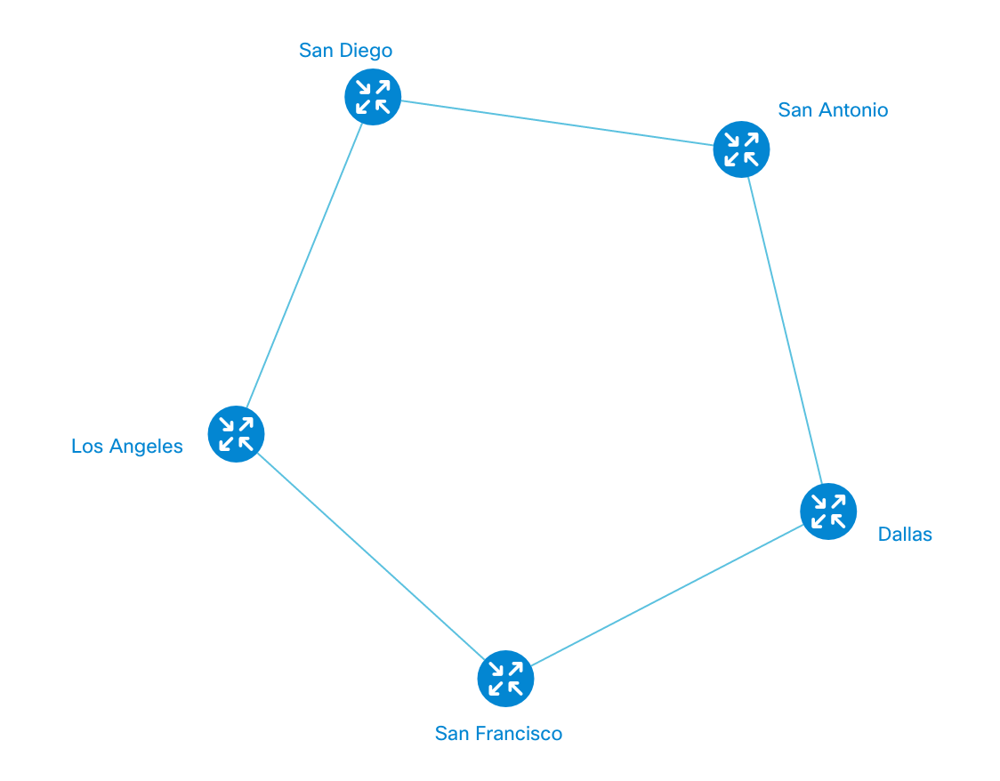
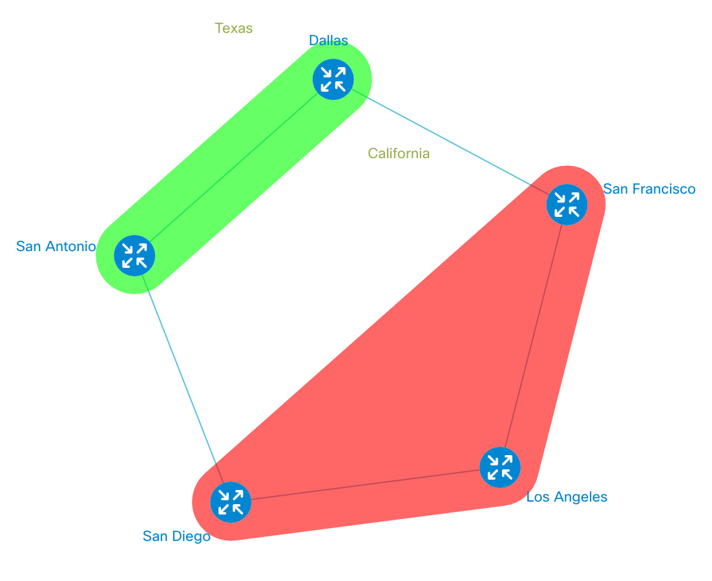

# Groups
Groups in NeXt is another way to show that nodes belong to the same party. The group highlights selected nodes with a background color that matches it. Let's move on to see the example.

## Example
### Topology data
We are going to start with the topology data:

```JavaScript
var topologyData = {
	// define 3 nodess
	"nodes": [
		{
			"id": 0,
			"name": "San Francisco"
		},
		{
			"id": 1,
			"name": "Los Angeles"
		},
		{
			"id": 2,
			"name": "San Diego"
		},
		{
			"id": 3,
			"name": "Dallas"
		},
		{
			"id": 4,
			"name": "San Antonio"
		}
	],
	// and links
	"links": [
		{
			"source": "San Francisco",
			"target": "Los Angeles"
		},
		{
			"source": "San Francisco",
			"target": "Dallas"
		},
		{
			"source": "San Antonio",
			"target": "Dallas"
		},
		{
			"source": "San Diego",
			"target": "Los Angeles"
		},
		{
			"source": "San Antonio",
			"target": "San Diego"
		}
	]
};
```

That's a pentagon that looks like this:



### Add groups
Assuming you have the topology configuration and it is stored in ```topo``` object, we're going to create a simple [event handler](tutorial-005.md). You may be not familiar with what that is, but the long story short, that's a function that NeXt invokes when something happens. In our case, that *something* is the point when the topology was generated. You'll get to know about event handlers more quite soon, so let's just keep things simple for now.

```JavaScript
topology.on("topologyGenerated", function() {

	var groupsLayer = topology.getLayer("groups");
	var nodesDict = topology.getLayer("nodes").nodeDictionary();

	var nodes1 = [nodesDict.getItem("San Francisco"), nodesDict.getItem("Los Angeles"), nodesDict.getItem("San Diego")];
	var group1 = groupsLayer.addGroup({
		nodes: nodes1,
		label: 'California',
		color: '#f00'
	});

	var nodes2 = [nodesDict.getItem("Dallas"), nodesDict.getItem("San Antonio")];
	var group2 = groupsLayer.addGroup({
		nodes: nodes2,
		label: 'Texas',
		color: '#0f0'
	});

});
```

```topo.on``` sets the event listener (asks NeXt to notify this piece of code when something happens). ```topologyGenerated``` is the name of the event we're tracking. The built-in event names are well-known and described. The second parameter is an anonymous function, so called *callback function*. It will be called when the event takes place.

Then we do the same operations we did for path drawing: get layer, get nodes' dictionary (to conveniently get them).

```groupsLayer.addGroup``` has a simple configuration:

* **nodes** is an array of nodes' instances
* **label** (optional) is a label assigned to the group and displayed next to it
* **color** is the background color of the group in RGB hex format 

See full code listing on [Codepen]()

### Result
Finally, you should be seeing something like this:



The green and red areas are the groups.

## Remove Node Groups
TBD

## What's next?


