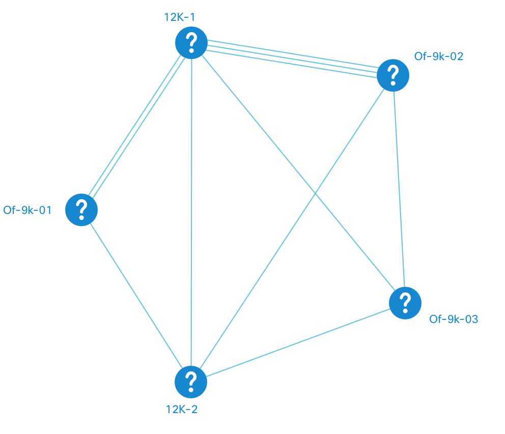
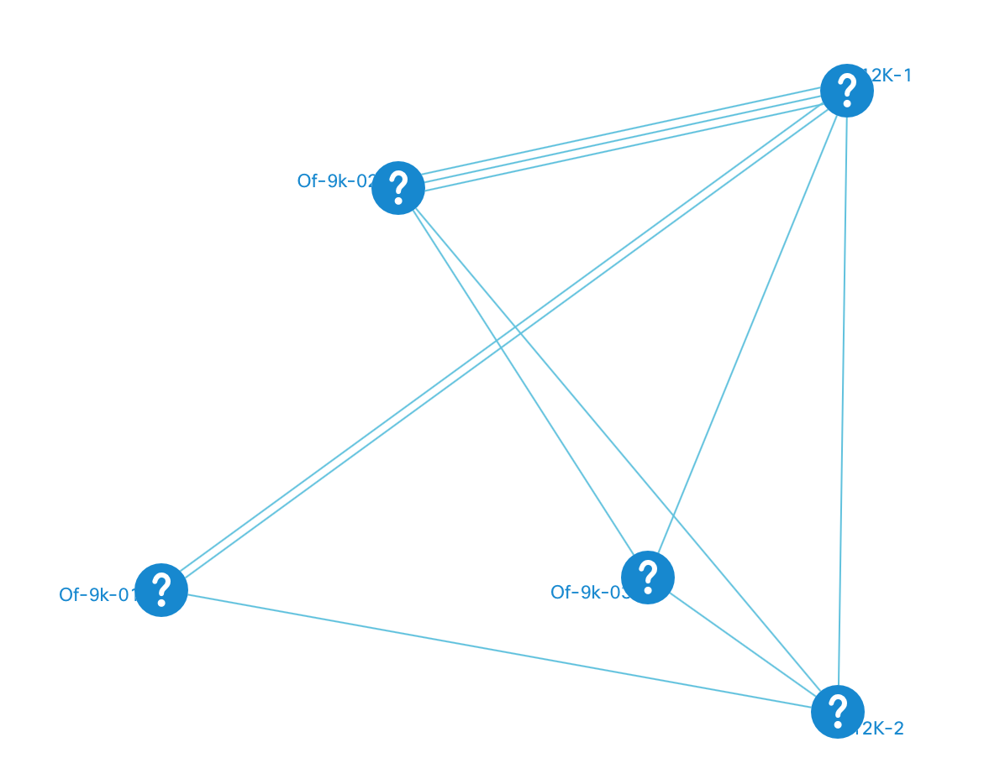

# Data Processors
Data processor (DP) is a class that processes topology data in one or another way. The way we usually use them in NeXt is to assign special positioning to the nodes, or modify the input information so that its representation would match our purposes.

In other words, when you use a DP over a chunk of topology data, it modifies something in it, depending on the purpose you do that.

## Built-in DPs

Before you get the detailed description of each data processor, let us give you more information on where you can find the code:

* You can normally find the DP classes at the following path: ```/src/js/graphic/data/processor``` 
* If you navigate to the ```/src/js/graphic/data/dataprocessor.js```, you'll find the place where all the DPs get included as static members.

Now let's look over each DP.

### Force
**Force** data processor create a fundament for autolayout. Essentially what it does is it spreads out the nodes automatically so they would as equally distant as possible. That makes a beautiful picture without you assigning the x/y positioning to the nodes.

#### Force: Usage
In order to use Force DP, you will need to set the ```dataProcessor``` property in topology configuration to "force". 

```JavaScript
nx.define("Topo", nx.graphic.Topology, {

	// ... some properties ...
	
	"dataProcessor": "force"
	
	// ... some properties ...
});
```

#### Force: demo



"Force" data processor on [Codepen](http://codepen.io/NEXTSUPPORT/pen/EgbLGg)

### Quick
Quick data processor essentially assigns random [x;y] position to each node. Compared to the "Force" DP, there's no logic that spreads out the nodes or make up a beautiful shape of the topology. Just random position.

#### Quick: demo



"Quick" data processor on [Codepen](http://codepen.io/NEXTSUPPORT/pen/OROkgv)

## Create Your DP
The machanism of creation data processors does not currently exist. Hold on to using the built-in ones.

## What's Next?
The next tutorial will teach you to use layouts.

[Read NEXT](./tutorial-003-06.md)