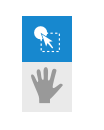
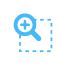
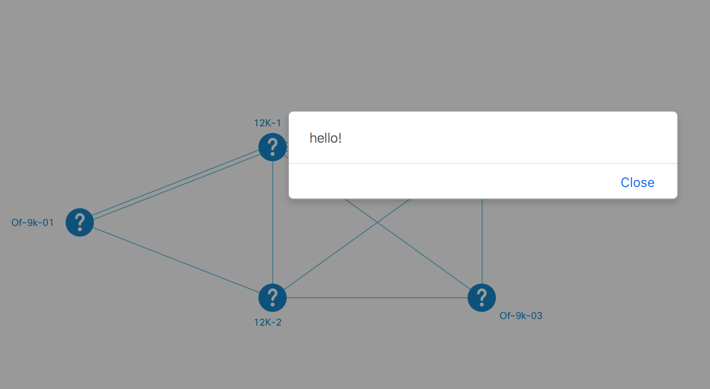

# Scene
**Scene** is a customizable object that works as a bundle of topology events, such as *nodeClick*, *enterLink* and so forth. 

*Why might I that?* &mdash; I hear a reasonable question. The Scene is a way to scale existing topology's behavior, or to switch between different behaviors. The different behaviors depend on mode: like normal mode, or selection mode. You must agree that requires different approaches, and that's where scenes kick in.

## Default Scene
This scene performs normal, default event handling, when user interacts with the topology. You don't need to activate it. It can be extended if specific events are to be activated or deactivated, or when a developer needs to alter their behavior. 

## Other Scenes
### Selection Scene
Activates automatically, when a user decides to select a range of nodes (via the navigation panel). 

The icon in the panel will look like this after selection:



If you interested in the source code, go the NeXt repo and navigate down the directories: ```src/js/graphic/topology/scene/SelectionScene.js```

### Zoom Scene
This scene becomes active by user's choice, when they need to zoom in by selection of the target area. In this mode a plenty of standard operations deactivate.

The active icon in the navigation panel will turn light blue:



The source code for this class is location down in: ```src/js/graphic/topology/scene/ZoomBySelection.js```

## Extend Scene
Scene extension consists in 3 trivial steps. This tutorial assumes extension of the *default scene*.

### Define It
The first step is to create a new class. The name is ```ExtendedScene``` and it extends ```nx.graphic.Topology.DefaultScene```.

```JavaScript
nx.define('ExtendedScene', nx.graphic.Topology.DefaultScene, {
	methods: {
		clickNode: function(sender, node){
			this.inherited(sender, node);
			alert("hello!");
		}
	}
});
```

The only modification is ```clickNode```, the function will make a message "hello!" pop up on screen.


### Register It
You need to register the scene, that is to bind it to the topology's instance.

```JavaScript
topo.registerScene('extended-scene', 'ExtendedScene');
```

### Activate It
When you are ready to interact with the scene, activate it.

```JavaScript
topo.activateScene('extended-scene');
```

## Result
The screenshot below shows that the new scene has been activated and put in effect: now user makes a dialog window show up when they click a node.



Look over example on [Codepen](http://codepen.io/NEXTSUPPORT/pen/kkxVxg/)


## What's next?
The topology's section is over. Congrats! Now you are going to read about class and implementation of object-oriented programming in NeXt.

[Read NEXT](./tutorial-004.md)