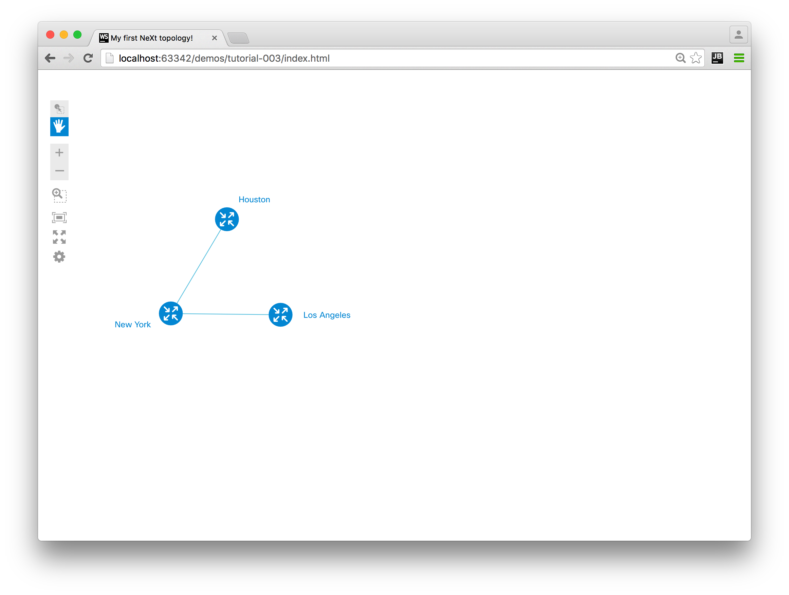

# Tutorial #3: Your First Topology
In the [past tutorial](./tutorial-003.md) you got to know Common Topology Model. This lesson will help you to employ this knowledge to spin up a basic NeXt application.

## Define the file structure

Now that you downloaded NeXt library, put it under /js/next/, while and our project-specific files will be located under /app/. 

These are app.js and data.js - you'll get back to them momentarily, but now make sure you have the index.html in the root and file structure like it goes below:

```
app/
    app.js
    data.js
js/
    next/
        ... NeXt library go here ...
index.html
```

## JavaScript aside: Brief introduction to closures
When you work with JavaScript libraries from third parties, it's a good habit to use [immediately-invoked function expressions](https://en.wikipedia.org/wiki/Immediately-invoked_function_expression) (or, simply "closures"). 
 
This is how you may use them:

```
// example.js

(function(localVar1, localVar2){

    // you code goes here...

})(globalVar1, globalVar2);

```

**TL;DR**

You will be able to use localVar1 and localVar2 as global objects globalVar1 and globalVar2, but your variables will not be visible from the global namespace (from outside this code).

**More detailed explanation**


*globalVar1* and *globalVar2* are variables, accessible from global namespace. If you want to use them and not to pollute global namespace with your variable, closures come to the rescue. In this example *globalVar1* transforms to *localVar1* and *globalVar2* transforms to *localVar2*. That means that variables passed into the immediately-invoked function ()() will become local from the anonymous function's point of view.  

This is good when you want to achieve modularity and keep you code clean.

## Create data.js

This file will contain topology data that we want to display. Here's our example topology, but you may want to build your own to get more expertise.

```
var topologyData = {
	"nodes": [
		{
			"id": 0,
			"name": "New York"
		},
		{
			"id": 1,
			"name": "Los Angeles"
		},
		{
			"id": 2,
			"name": "Houston"
		}
	],
	"links": [
		{
			"source": 0,
			"target": 1
		},
		{
			"source": 0,
			"target": 2
		}
	]
};
```

Note: Description of each node and link will go into an object called *model*. Every topology entity has this object. I'll teach you how easy it is to handle it later, for now just remember there is a model behind each node and link in topology.

## Create app.js

I am writing the code inside closures in app.js and it is available for you under **/demos/tutorial-003/**

### Code

```
(function(nx){

	// instantiate NeXt app
	var app = new nx.ui.Application();

	// configuration object for next
	var topologyConfig = {
		// special configuration for nodes
		"nodeConfig": {
			"label": "model.name",
			"iconType": "router"

		},
		// special configuration for links
		"linkConfig": {
			"linkType": "curve"
		},
		// if true, the nodes' icons are shown, otherwise a user sees a dot instead
		"showIcon": true,
		// automatically compute the position of nodes
		"dataProcessor": "force"

	};

	// instantiate Topology class
	var topology = new nx.graphic.Topology(topologyConfig);

	// load topology data from app/data.js
	topology.data(topologyData);

	// bind the topology object to the app
	topology.attach(app);

	// app must run inside a specific container. In our case this is the one with id="topology-container"
	app.container(document.getElementById("topology-container"));

})(nx);
```

### Comments

I commented out the code, but let's get into details. 

First off, we need to get an instance of the application class:

```
var app = new nx.ui.Application();
```

This is an abstraction for NeXt apps, and there are usually quite a few things we do with it:

* Initialize it - just like we did below
* Attach a topology to the application object
* Set a DOM container for the the app

The latter two you saw in the code, but what is more important is the configuration for topology. I created a *topologyConfig* object, which actually implements basic configuration.

The object has a bunch of properties, that make your topology look one way, or another. I'll cover the entire list of properties with comments in the NeXt tutorial, now I'll just describe those used for this example.

* **nodeConfig** - configuration object for all nodes. For this particular case we used the two its properties: *label* and *iconType*. Do you remember that every node and link has a *model*? Now it's time to use it. We used the two properties: *id* and *name* to describe the nodes, and those properties was put into the models. In order to read a name of a node and use it as a node label on the screen, when need to use the syntax ```"label": "model.name"```. This will give us access to the properties of model. Also, you are capable of choosing an icon for a node, just pick a built-in one, or register yours.
* **linkConfig** - same sort of thing, we'll cover it in the next chapter.
* **showIcon** - boolean prop, which turns icon depiction on or off.
* **dataProcessor** - NeXt has a few built-in data processors (don't worry, this will be covered as well), and also you can spin up yours. This is the case we're using "force" data processor, which is actually the one that automatically computes nodes' coordinates based on their connection. That is, you don't have to worry about setting a position for every node. Try to remove this property and see what happens.


## Create index.html
We have all of our code ready now, so the only thing left is to make up an HTML webpage that fetches the above code. This will be easy one.

```
<!DOCTYPE html>
<html>
<head>
	<title>My first NeXt topology!</title>
	<link rel="stylesheet" href="../common/next/css/next.css">
	<script type="text/javascript" src="../common/next/js/next.js"></script>
</head>
<body>
	<div id="topology-container"></div>
	<script type="text/javascript" src="app/data.js"></script>
	<script type="text/javascript" src="app/app.js"></script>
</body>
</html>
```

## Result
Once you open the index.html in a web-browser (we recommend Google Chrome), we should be able to see the following:



The nodes may have different positioning, because for this particular example "force layout" is used. Force layout is a feature in NeXt that allows you to spread out nodes around your screen automatically.

## What's next?

This tutorial showed you a skeleton of NeXt app. This basically consists of defining topology data (either remote or local), defining a few topology attributes, instanstiation of topology and app classes and then binding these JS objects to HTML view.

Right now you can interact with the topology in a simple way: drag nodes, zoom in/out and do a few other things. But we want to have full control over the graph, don't we? This is why we'll need to augment behavior of the app with a bunch of things like custom nodes and links, custom events and so on. 

Now we need to get to know a bit more stuff about merely topology customization, before we put our hand to customization of its elements. Ready?

[Read NEXT](tutorial-004.md)