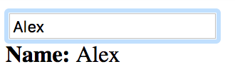

# Property Binding

Roughly, *Data binding* is the process of binding binding a JS model and HTML/DOM model. Developers differentiate one-way binding and two-way binding. 

The *one-way binding* is usually control over DOM from JS model. The *two-way binding* has, obviously, data flows in both directions: from the view to model and from model to view. That means, if you are changing value in the form, it will be immediately changing in the model, and vice versa.

NeXt incorporates the two-way binding.

Nuff said. How about a sample?

## Example
### Code
We are continuing to explore ```nx.ui.Component```. 

```JavaScript
nx.define("ExampleForm", nx.ui.Component, {
	"properties": {
		"name": "Jack"
	},
	"view": {
		"content": [
			{
				"tag": "input",
				"props": {
					"value": "{#name}"
				}
			},
			{
				"tag": "div",
				"content": [
					{
						"tag": "span",
						"content": "Name: ",
						"props": {
							"style": "font-weight: bold;"
						}
					},
					{
						"tag": "span",
						"content": "{#name}"
					}
				]
			}
		]
	}
});
```

On the whole, that's pretty much the exact same thing we saw in the previous article. Except for ```{#name}``` and a new property.

Essentially, ```{#...}``` is just a way to interpolate a variable's value into a string. Instead of ```...``` you should use the name of expected property. Therefore ```{#name}``` is the way to display the value of the property in the view.

### Screenshot
This's what the code should render into. When you are typing a name, the caption underneath will be changing.



Check out [Codepen](http://codepen.io/NEXTSUPPORT/pen/XjJBJm) example.

## What's Next?
We've learned the way to bind properties, now let's proceed to the methods.

[Read NEXT](./tutorial-006-02.md)
