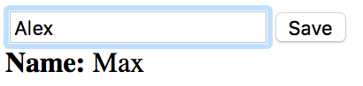

# Event Binding
We are going to bind methods to the events. That said, should an event like a click, hovering, double-click occur, the method will be called.

## Example
### Code
We are going to reuse the code from the previous article, but we'll change it a little bit.

```JavaScript
nx.define("ExampleForm", nx.ui.Component, {
	"properties": {
		// name to display
		"name": "",
		// name to change from form
		"tempName": ""
	},
	"methods": {
		"saveName": function(){
			// use a setter over getter
			this.name(this.tempName());
		}
	},
	"view": {
		"content": [
			{
				"tag": "div",
				"content": [
					{
						"tag": "input",
						"props": {
							"value": "{#tempName}"
						}
					},
					{
						"tag": "button",
						"content": "Save",
						"events": {
							"click": "{#saveName}"
						}
					}
				]
			},
			{
				"tag": "div",
				"content": [
					{
						"tag": "span",
						"content": "Name: ",
						"props": {
							"style": "font-weight: bold;"
						}
					},
					{
						"tag": "span",
						"content": "{#name}"
					}
				]
			}
		]
	}
});
```

Here we use a buffer, the ```tempName``` property. Like I said, since NeXt UI has two-way data binding, we might need to process the new value before we override the former. In this example, we keep the old value in ```name``` prop until a user clicks the *Save* button. The *click* event triggers ```saveName``` method, which in its turn copies text from the buffer to the main storage. 

### Screenshot
The result should like that and is available on [Codepen](http://codepen.io/NEXTSUPPORT/pen/JRoByJ).



## What's next?
Some routine could be simplified. Use templates to achieve it.

[Read NEXT](./tutotial-006-03.md)