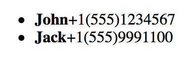

# Templates

Templates are here to reduce the amount of code you type to display values of an array, by iterating the values of the array.

## Snippet
```JavaScript
nx.define("ContactList", nx.ui.Component, {
    view: {
        tag: 'ul',
        props: {
        	  // items to iterate on
            items: '{#contacts}',
            // template for iterations (will remain the same for the items)
            template: {
                tag: 'li',
                content: [
                    {
                    	"tag": "span",
                        "content": "{name}",
                        "props": {
                        	"style": "font-weight: bold;"
                        }
                    },
                    {
                    	"tag": "span",
                    	"content": "{phone}"
                    }
                ]
            },
            props: {
                // any HTML attributes go here
            }
        }
    },
    properties: {
        contacts: null
    }
});

// input array
var contacts = [
	{
		"name": "John",
		"phone": "+1(555)1234567"
	},
	{
		"name": "Jack",
		"phone": "+1(555)9991100"
	}
];

// create new UI component
var contactList = new ContactList();
// pass the input array and render it in UI
contactList.contacts(contacts);
```

See full [Codepen](http://codepen.io/NEXTSUPPORT/pen/qabQqB) example.

## Demo


## What's next?
That one's been pretty straight-forward, hasn't it? We'll go on to learn a way to modify *view* and inherit it in a new class.

[Read NEXT](./tutorial-006-04.md)