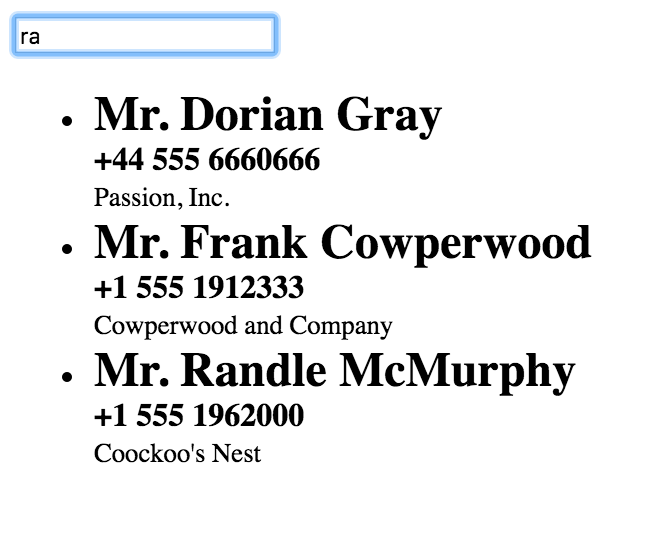

# MVVM
NeXt supports MVVM concept (Model-View-View Model) that derives from well known MVC (Model-View-Controller). This tutorial provides details about MVVM itself, as well as a way to apply it to a NeXt application.

## What is that?

> See the picture's attribution details on [WikiMedia Commons](https://commons.wikimedia.org/wiki/File:MVVMPattern.png) page.

### Model
*Model* is a data layer that provides access to data. In NeXt that a class with its own properties and methods.

### View
*View* is graphical (web) representation of model, that user sees, feels and interacts with.

### View Model
*View model* is usually described as an application's business logic. It binds the view to model, enabling data processing before displaying to user. It also works as interaction layer for the view, because it accepts interaction from user to convey it to the model.

### Okay, now what?
Complex and serious (*I know, that sounds too general -- however you should think of that yourself*) applications, or applications' modules, built entirely in NeXt will be potential consumers of MVVM. MVVM has much abstraction that can kill "pocket" applications, which means you'll waste numerous time to develop and maintain the app.

One more thing you should consider is the environment you work in. If you have already chosen a framework that employs MVVM or MVC, additional MVVM layer by NeXt will be overengineering.

## Typical architecture & Example
### Create Model

```JavaScript
nx.define("ContactModel", {
	properties: {
		firstName: null,
		lastName: null,
		title: {
			get: function(){
				return (this.gender === "male") ? "Mr." : "Ms."
			}
		},
		fullName: {
			get: function () {
				return this.title() + " " + this.firstName() + " " + this.lastName();
			}
		}
	},
	methods: {
		init: function (args) {
			this.inherited();
			this.sets(args);
		}
	}
});
```

### Create View

```JavaScript
nx.define('ContactView', nx.ui.Component, {
	view: {
		content: [
			{
				tag: 'input',
				props: {
					'class': 'input-search',
					value: '{filterKey}',
					placeholder: 'Search...'
				}
			},
			{
				tag: 'ul',
				props: {
					'class': 'contact-list',
					template: {
						tag: 'li',
						events: {
							click: '{showInfo}'
						},
						content: [
							{
								tag: 'div',
								content: '{fullName}',
								props: {
									style: "font-size: 24px; font-weight: bold;"
								}
							},
							{
								tag: "div",
								content: "{phone}",
								props: {
									style: "font-weight: bold;"
								}
							},
							{
								tag: 'small',
								content: '{company}'
							}
						]
					},
					items: '{filteredContacts}'
				}
			}
		]
	}
});
```

### Create ViewModel

```JavaScript
nx.define('ContactViewModel', nx.data.ObservableObject, {
	properties: {
		contacts: null,
		filteredContacts: null,
		filterKey: {
			get: function () {
				return this._filterKey;
			},
			set: function (value) {
				this._filterKey = value;
				this.filter(value);
			}
		}
	},
	methods: {
		init: function () {
			this.inherited();
			this.contacts(new nx.data.ObservableCollection());
			this.filteredContacts(new nx.data.ObservableCollection());
			this.load(contacts);
		},
		load: function (contacts) {
			contacts.forEach(function (item) {
				this.contacts().add(new ContactModel(item));
				this.filter(null);
			}, this);
		},
		filter: function (key) {
			this.filteredContacts().clear();
			this.contacts().each(function (contact) {
				if (!key || contact.fullName().toLowerCase().indexOf(key) >= 0) {
					this.filteredContacts().add(contact);
				}
			}, this);
		}
	}
});
```

### Create data file

```JavaScript
var contacts = [
	{
		"firstName": "Harry",
		"lastName": "Potter",
		"company": "Hogwarts",
		"phone": "+44 555 1997000",
		"gender": "male"
	},
	{
		"firstName": "Dorian",
		"lastName": "Gray",
		"company": "Passion, Inc.",
		"phone": "+44 555 6660666",
		"gender": "male"
	},
	{
		"firstName": "Frank",
		"lastName": "Cowperwood",
		"company": "Cowperwood and Company",
		"phone": "+1 555 1912333",
		"gender": "male"
	},
	{
		"firstName": "Dagny",
		"lastName": "Taggart",
		"company": "Taggart Transcontinental",
		"phone": "+1 555 1860777",
		"gender": "female"
	},
	{
		"firstName": "Randle",
		"lastName": "McMurphy",
		"company": "Coockoo's Nest",
		"phone": "+1 555 1962000",
		"gender": "male"
	}
];
```

### Tie it up and launch

```JavaScript
var app = new nx.ui.Application();

var contactViewModel = new ContactViewModel();
var contactView = new ContactView();

contactView.model(contactViewModel);

contactView.attach(app);

app.container(document.getElementById("next-container"));
```

## Result


## What's next?
We are going to talk about a *stage*.

[Read NEXT](tutorial-006-06.md)