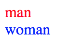

# NeXt UI
UI is a module in NeXt that offers a way to design your own chunk user interface with NeXt. The class ```nx.ui``` and its subclasses accomplish the entire thing. The most important concept that goes along with it is *view*.

## Basic Example
Let's take a look at a simple UI component.

```JavaScript
nx.define("MyComponent", nx.ui.Component, {
	"view": {
		"content": {
			"tag": "a",
			"content": "hello",
			"props": {
				"href": "http://example.com"
			}
		}
	}
});
```

It renders a single link:


[Demo on Codepen](http://codepen.io/NEXTSUPPORT/pen/PGwOyg)


This code will be translated into a DOM object. As an example, the following HTML code has the same DOM analogy: 

```HTML
<a href="http://example.com">hello</a>
```

The component ```MyComponent```incorporates the ```view``` and may or may not have properties or methods. The view consists of one or more objects, each of them represents content inside.

## Extended Sample

As we said, the view could have a multi-level structure. 

```JavaScript
nx.define("MyComponent", nx.ui.Component, {
	"view": {
		"content": [
			{
				"tag": "div",
				"content": "man",
				"props": {
					"style": "color: #f00;"
				}
			},
			{
				"tag": "div",
				"content": "woman",
				"props": {
					"style": "color: #f00;"
				}
			}
		]
	}
});
```

That's how it renders:



[Demo on Codepen](http://codepen.io/NEXTSUPPORT/pen/ALjbJq)

## A Little Documentation
That's time to pay some attention to the details. Below is the description of each special keyword we used in the examples.

1. **view**: configuration of the visible content
2. **content**. Depends on the type:
   1. *String*. This is what will be the content of a tag, or if no tags specified, just a text value.
   2. *Array*. Just a wrapper for multiple children. Cannot have *props*.
   3. *Object*. Composite object, often a DOM model. In other words, that's a model of an HTML tag. In this case, it has or may have the following properties:
      1. **tag**: name of the HTML tag
      2. **name**: unique name of the subcomponent *view* accross the entire component. You'll be able to retrieve that (not so) tiny piece from any method in the ```nx.ui.Component``` to modify it dynamically. In other words, this is the identifier.
      3. **type**: if this is supposed to be an instance of a class, specify its type (class name) here
      4. **content**: it could be a string, another object or an array. Just loop back to the #2 and read once again
      5. **props**: HTML properties. In ``````, ```src``` is the HTML property and you may want to specify it in the *props*.
   

## What's the View?
View is a virtual object model. It plays a key role because:

* It binds the presentation of object (HTML, CSS) with the behavior the object (roughly, JavaScript) is supposed to have;
* It defines the way the object looks like;
* The object model has a strong hierarchical and modular structure, allowing a developer eject a molecular piece of it and inject new attributes and behavior in it.

## What's The Component?
*Yeah, you've used that nx.ui.Component and did not tell us about it!*

That's what you're thinking - and finally it's to learn a bit more about the components. Indeed, the component is something that meets MVVM or MVC criteria. principles:

* view is view
* properties are model
* methods' binding is something that enables viewmodel

Too much theory? Let's keep it simple. The ```nx.ui.Component``` is a distinct object in a user interface. Because, it is visual, the *view* will take care of presentation. *Properties* will store data and enable data binding. *Methods* will enable logic and behavior. Now we get the object in our topology that can interact with a user!

If you're a still a kind confused, just move on and we'll show you how it rolls.

## Alternatives
Yep. For specific situation we'd recommend you to stick with NeXt UI, but some things could be done more efficiently with free open-source alternatives out there:

* **Angular JS**: perfect if you are in a process of building an Angular app. Honestly, we've completed a number of projects with NeXt and Angular 1 tightly coupled 
* **React**: JSX-enabled tool for generating virtual DOM in UI
* something we did not try or don't know about - you're welcome to tell us about your experience

## Cool, what next?
We are about to get data binding working. The user will read the data and write the data. The way you need it.

[Read NEXT](./tutorial-006-01.md)
 
