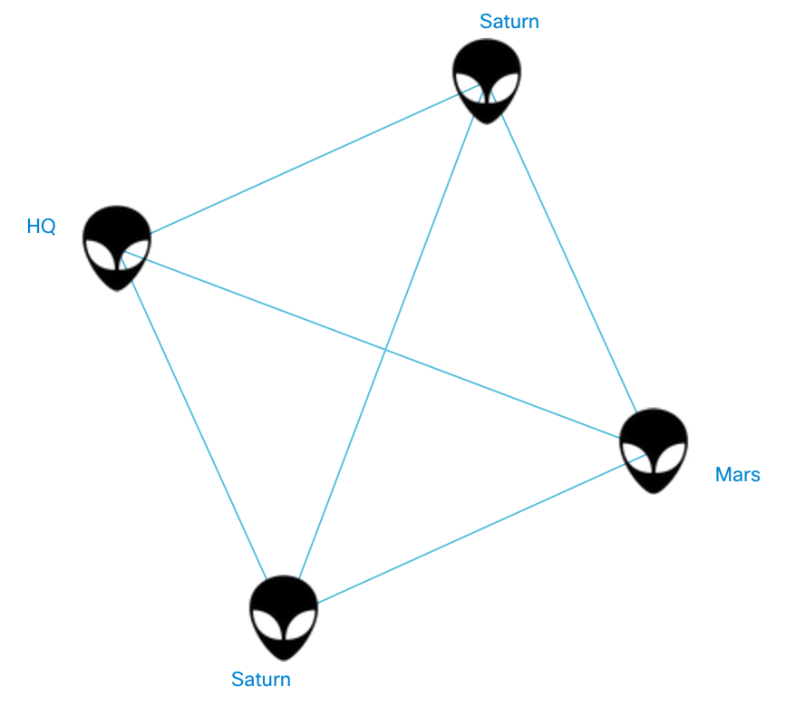
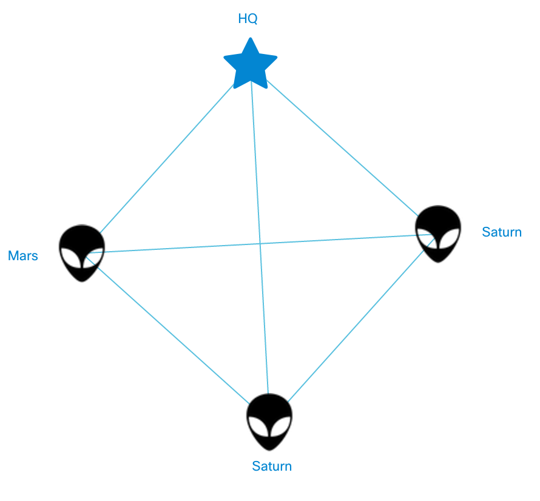

# Custom Icons

The first thing you see when you open a NeXt application is *nodes*. We created a set of networking icons that would satisfy your needs. But if you use NeXt for something irrelevant to networking, you are welcome to extend the standard icon list with a something from PNG, GIF or JPEG all the way to font icons. Yes, you can use even *font icons* like [Font Awesome](http://fontawesome.io) or [GLYPHICONS](http://glyphicons.com).

## Image Icons

To make an image icon display you need to:

1. Upload a picture to the project directory
2. Register icon
3. Define the condition on which the icon will show up

Let's roll! Here is the new icon we will use for nodes:


You can find it in this repository at the following address: ```/images/tutorial-007-02/alien.png```

Create a folder called ```images``` in the project's root and place the picture into it to make the file structure look as follows:

```
app/
	main.js
	topology.js
	topology_data.js
bower_components/
	next-bower/
images/
	alien.png
index.html
style.css
```

Now you need to make two simple changes in the files:

### app/main.js (excerpt)

Open app/main.js and modify it as follows:

```JavaScript
// ...

// instantiate Topology class
	var topology = new MyTopology();

// ADD THIS LINE HERE
topology.registerIcon("alien", "images/alien.png", 40, 48);

// load topology data from app/data.js
	topology.data(topologyData);

// ...

```

Simply add ```topology.registerIcon``` line. That will assign a picture resource to the symbolic label, which is ```alien```.

### app/topology.js (excerpt)

All you need to do here is to set ```iconType``` to ```alien```, like it's shown below:

```JavaScript
// ...

// special configuration for nodes
'nodeConfig': {
	'label': 'model.name',
	'iconType': 'alien',
	'color': '#0how00'
}

// ...
```

What you should be getting as the result of your operations is:



Beautiful :) Move on!

## Font Icons
Font icons are special icons that use standard techniques of depicting symbol charactars (A-z, 0-9 etc.) to display any drawn symbol. You can read more on the topic, I would just say you ought to use this one for size-dependent icons (nodes, for example). 

We are going to use FontAwesome and its [Star icon](http://fontawesome.io/icon/star/) as a nice example.

First of all, run this in terminal to download FontAwesome:

```
bower install font-awesome
```

That will nstall font-awesome under ```/bower_components/font-awesome/``` directory.

Let's link the CSS file:

### index.html (excerpt)

```HTML
<!-- ... -->

<script type="text/javascript" src="bower_components/next-bower/js/next.min.js"></script>
<!-- Font Awesome -->
<link rel="stylesheet" href="bower_components/font-awesome/css/font-awesome.min.css">
</head>

<!-- ... -->
```

Aliens are cool, but the headquarters (HQ) node is also depicted as the alien. Let's distinguish it.

The plan is similar to what we've just done with normal pictures, except for the first step: now we to Find out what code the Star symbol has. According to [FontAwesome's documentation](http://fontawesome.io/icon/star/), you will see the star if you use CSS class ```fa-star```. Ok, head to the CSS file ```/bower_components/font-awesome/css/font-awesome.css```... and look for ```fa-star```:

Gotcha!

### /bower_components/font-awesome/css/font-awesome.css (excerpt)

```CSS
/* ... */
.fa-star:before {
  content: "\f005";
}
/* ... */
```

See that ```\f005```? That's the character code we need.


### app/main.js (excerpt)

Add the ```nx.graphic.Icons.registerFontIcon``` line to the file like that:

```JavaScript
// ...

// instantiate Topology class
var topology = new MyTopology();

// add icons
topology.registerIcon("alien", "images/alien.png", 40, 48);
nx.graphic.Icons.registerFontIcon("icon_hq", "FontAwesome", "\uf005", 48);

// load topology data from app/data.js
topology.data(topologyData);

// ...
```

Make sure to alter ```\f005``` to ```\uf005```. And avoid using capital case letters in the icon identifier.

### app/topology_data.js (excerpt)
Let's add the property that unambiguously defines the node status: ```"status": "hq"```. Like this:

```JavaScript
// ...

{
	"id": 0,
	"name": "HQ",
	"status": "hq"
}

// ...
```

### app/topology.js (excerpt)
Now we are going to create a sort of logic that would distinguish node with special "hq" status with a star icon:

```JavaScript
// ...

'iconType': function (model, node) {
	var status = model.get("status");
	if(typeof status == "string" && status == "hq")
		return "icon_hq";
	return "alien";

}

// ...

```

What do you have now? It works here and that's what I have:



## What's Next?
Now that we've learned to register icons and apply them to specific nodes, we are ready for the next customization: extend node class.

[Read Next](/tutorials/tutorial-007-03.md)
