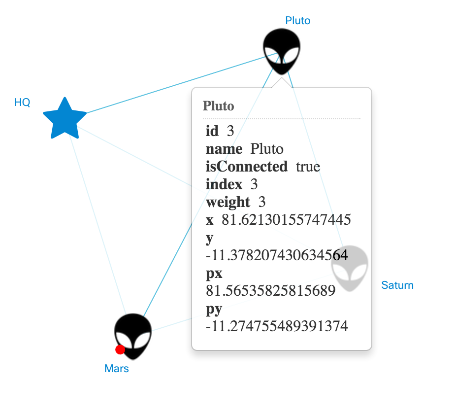
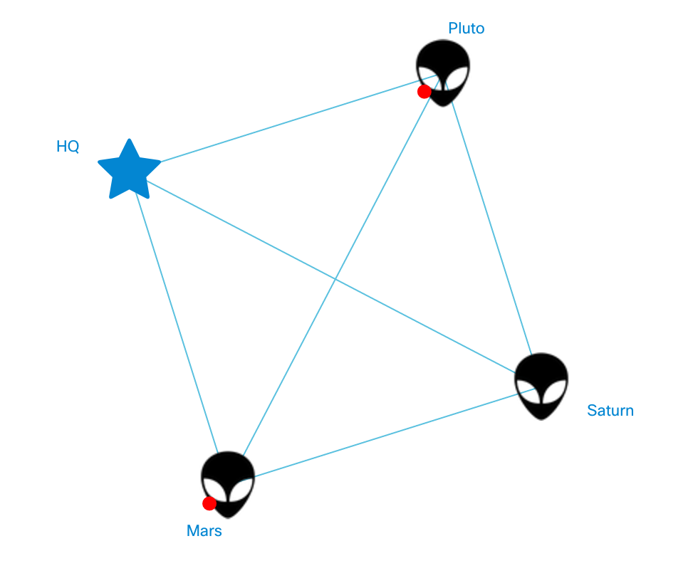

# Tooltip Policy Customization
Tooltip's policy is a set of rules (or rather a class with its own properties and methods) that declare the way when and why tooltips show up on the screen.

## Task
[In the last tutorial](tutorial-007-06.md) we managed to alter *click* event applied to nodes. Now that toggles the status of connection. However, we saw it had not affected the tooltips that appeared after the click anyway.

This lesson will teach you "train" the tooltips. Like it goes in the introduction, there's the tooltip policy that does it. With its help, we'll work around the issue we ran into.

## Implementation
### Extend the policy
You should be already gotten used to extending everything in NeXt :) That's not an exception.

There is the built-in policy, which is ```nx.graphic.Topology.TooltipPolicy``` class. The plan is to inherit it and modify a few methods.

Create a file with the name ```extended-tooltip-policy.js``` under ```app``` and take a look what is about to be inside:

#### /app/extended-tooltip-policy.js
```JavaScript
nx.define("ExtendedTooltipPolicy",nx.graphic.Topology.TooltipPolicy, {

	"properties": {
		topology: {},
		tooltipManager: {}
	},

	"methods": {

		// inherit methods and properties from base class (nx.graphic.Topology.TooltipPolicy)
		"init": function(args){
			this.inherited(args);
			this.sets(args);
			this._tm = this.tooltipManager();
		},

		// disable default behavior: "click" closes the tooltip
		"clickNode": function(node){
			this._tm.closeAll();
		},

		// overwrite default behavior: hovering the node makes tooltip show up
		"enterNode": function(node){
			var topo = node.topology();
			topo.tooltipManager().openNodeTooltip(node);
		},

		// overwrite default behavior: leaving the node makes tooltip hide
		"leaveNode": function(node){
			this._tm.closeAll();
		}

	}
});
```

To make NeXt know about the new policy class's child, you'll need to link it into the HTML page. Insert the line before the "main.js" inclusion.
#### index.html (excerpt)
```HTML
<!-- ... -->
<script type="text/javascript" src="app/extended-tooltip-policy.js"></script>
<!-- ... -->
```

The rule never applies with no declaration, therefore you need to plug in the new policy class into the topology object. It does not matter, where you insert the following line in, but I happen to have inserted right before the ```topology.data()``` line.

#### /app/main.js (excerpt)
```JavaScript
// ...
nxTopology.tooltipManager().tooltipPolicyClass('ExtendedTooltipPolicy');
// ...
```

It simply reassigns the tooltip policy class in tooltip manager.

## Result
Now a tooltip shows up, when a user's cursor is over the node:



Once they click, the tooltip disappears and the tiny pimple grows on the aliens face - that is, the we changed the status of the connection.



## What's next?
TBD